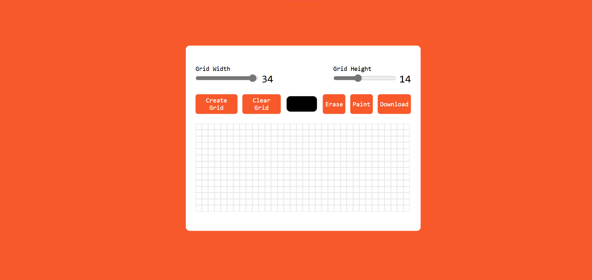

# Day #1

### Pixel Art Generator

# Pixel Art Generator



## Table of Contents
- [Introduction](#introduction)
- [Features](#features)
- [Getting Started](#getting-started)
- [Usage](#usage)
- [Contributing](#contributing)
- [License](#license)

## Introduction
The **Pixel Art Generator** is a web-based tool that allows users to create pixel art using a customizable grid. It is an intuitive and easy-to-use application where you can draw, erase, and color pixels to create your unique designs.

## Features
- Adjustable grid size (width and height)
- Color picker for choosing your drawing color
- Eraser tool to remove colors
- Clear grid functionality to start a new design
- Responsive design for both desktop and mobile devices

## Getting Started
### Prerequisites
To run the Pixel Art Generator, you need a modern web browser.

### Installation
1. Clone the repository:
   ```bash
   git clone https://github.com/yourusername/pixel-art-generator.git
   ```
2. Navigate to the project directory:
   ```bash
   cd pixel-art-generator
   ```
3. Open `index.html` in your web browser.

## Usage
1. Use the **Grid Width** and **Grid Height** sliders to set the dimensions of your grid.
2. Click the **Create Grid** button to generate the grid.
3. Select a color using the color picker.
4. Click on the grid cells to color them.
5. Use the **Erase** button to switch to erasing mode.
6. Use the **Paint** button to switch back to painting mode.
7. Click the **Clear Grid** button to remove all colors and reset the grid.

## Contributing
Contributions are welcome! If you have any ideas, suggestions, or improvements, feel free to create a pull request or open an issue.

### Steps to Contribute
1. Fork the repository.
2. Create a new branch:
   ```bash
   git checkout -b feature/your-feature-name
   ```
3. Make your changes and commit them:
   ```bash
   git commit -m "Add your feature"
   ```
4. Push to the branch:
   ```bash
   git push origin feature/your-feature-name
   ```
5. Open a pull request.

## License
This project is open-source and available under the [MIT License](LICENSE).

---

Enjoy creating your pixel art!

For any questions or support, please contact [hello@abdulmoiz.net](mailto:hello@abdulmoiz.net).
