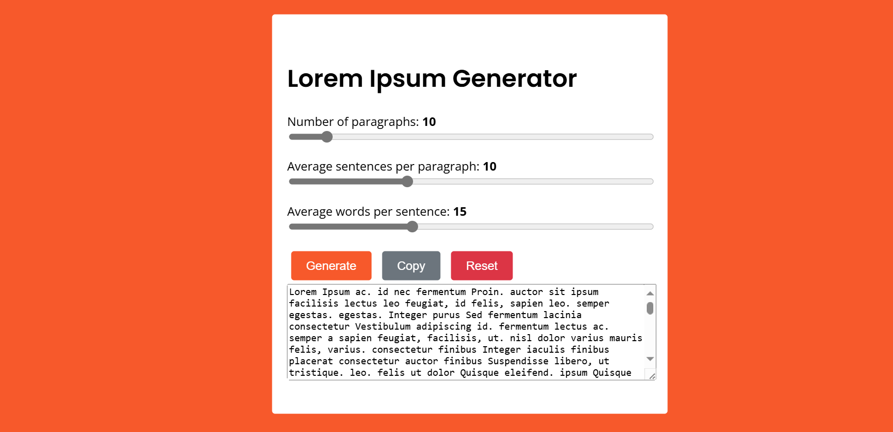

# Day #3

### Lorem Ipsum Generator

# Lorem Ipsum Generator



## Table of Contents
- [Introduction](#introduction)
- [Features](#features)
- [Getting Started](#getting-started)
- [Usage](#usage)
- [Contributing](#contributing)
- [License](#license)
- [Live Demo](#live-demo)

## Introduction
The **Lorem Ipsum Generator** is a web-based tool that allows users to generate random Lorem Ipsum text. It is a handy utility for developers and designers to create placeholder text for mockups and prototypes.

## Features
- Adjustable number of paragraphs
- Adjustable number of sentences per paragraph
- Adjustable number of words per sentence
- Buttons to generate, copy, and reset the Lorem Ipsum text
- Responsive design for both desktop and mobile devices

## Getting Started
### Prerequisites
To run the Lorem Ipsum Generator, you need a modern web browser.

### Installation
1. Clone the repository:
   ```bash
   git clone https://github.com/Moiz-CodeByte/100-days-of-javascript.git
   ```
2. Navigate to the project directory:
   ```bash
   cd 100-days-of-javascript/Day%20%2303%20-%20Lorem%20Ipsum%20Generator
   ```
3. Open `index.html` in your web browser.

## Usage
1. Adjust the number of paragraphs, sentences per paragraph, and words per sentence using the sliders.
2. Click the **Generate** button to create the Lorem Ipsum text.
3. Click the **Copy** button to copy the generated text to the clipboard.
4. Click the **Reset** button to reset the form and clear the output.

## Contributing
Contributions are welcome! If you have any ideas, suggestions, or improvements, feel free to create a pull request or open an issue.

### Steps to Contribute
1. Fork the repository.
2. Create a new branch:
   ```bash
   git checkout -b feature/your-feature-name
   ```
3. Make your changes and commit them:
   ```bash
   git commit -m "Add your feature"
   ```
4. Push to the branch:
   ```bash
   git push origin feature/your-feature-name
   ```
5. Open a pull request.

### After Opening a Pull Request
1. **Review**: Address any feedback or change requests made by the reviewers.
2. **Approval**: Wait for the pull request to be approved by the maintainers.
3. **Merge**: Once approved, the pull request will be merged by a maintainer.
4. **Close**: The pull request will be closed upon merging. If not merged, it might be closed manually with an explanation.
5. **Cleanup**: Delete your feature branch after the pull request is merged and update your local repository.

## License
This project is open-source and available under the [MIT License](LICENSE).

## Live Demo
You can see the Lorem Ipsum Generator live at [Link](https://moiz-codebyte.github.io/100-days-of-javascript/Day%20%2303%20-%20Lorem%20Ipsum%20Generator/)

For any questions or support, please contact at [hello@abdulmoiz.net](mailto:hello@abdulmoiz.net).

---

Enjoy generating your Lorem Ipsum text!

