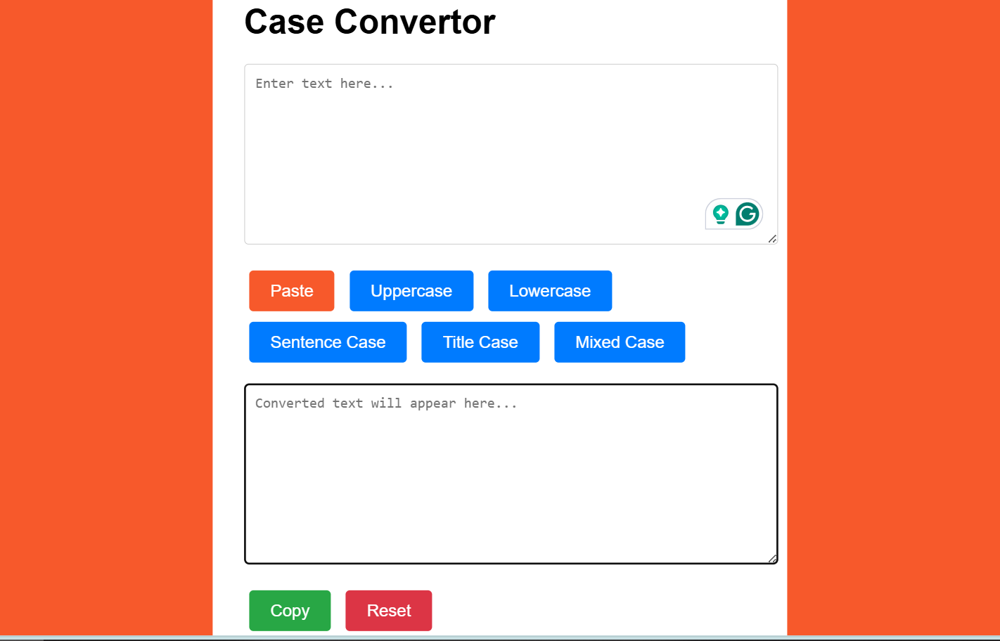

# Day #4

# Case Converter



## Table of Contents
- [Introduction](#introduction)
- [Features](#features)
- [Getting Started](#getting-started)
- [Usage](#usage)
- [Contributing](#contributing)
- [License](#license)
- [Live Demo](#live-demo)

## Introduction
The **Case Converter** is a web-based tool that allows users to convert text between different cases, such as uppercase, lowercase, sentence case, title case, and mixed case. It is an easy-to-use application that helps in formatting text efficiently.

## Features
- Convert text to uppercase
- Convert text to lowercase
- Convert text to sentence case
- Convert text to title case
- Convert text to mixed case
- Paste text from clipboard
- Copy converted text to clipboard
- Reset text fields
- Responsive design for both desktop and mobile devices

## Getting Started
### Prerequisites
To run the Case Converter, you need a modern web browser.

### Installation
1. Clone the repository:
   ```bash
   git clone https://github.com/Moiz-CodeByte/100-days-of-javascript.git
   ```
2. Navigate to the project directory:
   ```bash
   cd Day%20%2304%20-%20Case%20Convertor/
   ```
3. Open `index.html` in your web browser.

## Usage
1. Enter or paste your text into the input text area.
2. Click the appropriate button to convert the text:
   - **Paste**: Paste text from clipboard into the input field.
   - **Uppercase**: Convert text to uppercase.
   - **Lowercase**: Convert text to lowercase.
   - **Sentence Case**: Convert text to sentence case.
   - **Title Case**: Convert text to title case.
   - **Mixed Case**: Convert text to mixed case.
3. The converted text will appear in the output text area.
4. Click the **Copy** button to copy the converted text to the clipboard.
5. Click the **Reset** button to clear the input and output text areas.

## Contributing
Contributions are welcome! If you have any ideas, suggestions, or improvements, feel free to create a pull request or open an issue.

### Steps to Contribute
1. Fork the repository.
2. Create a new branch:
   ```bash
   git checkout -b feature/your-feature-name
   ```
3. Make your changes and commit them:
   ```bash
   git commit -m "Add your feature"
   ```
4. Push to the branch:
   ```bash
   git push origin feature/your-feature-name
   ```
5. Open a pull request.

### After Opening a Pull Request
1. **Review**: Address any feedback or change requests made by the reviewers.
2. **Approval**: Wait for the pull request to be approved by the maintainers.
3. **Merge**: Once approved, the pull request will be merged by a maintainer.
4. **Close**: The pull request will be closed upon merging. If not merged, it might be closed manually with an explanation.
5. **Cleanup**: Delete your feature branch after the pull request is merged and update your local repository.

## License
This project is open-source and available under the [MIT License](LICENSE).

## Live Demo
You can see the Case Converter live at [Link](https://moiz-codebyte.github.io/100-days-of-javascript/Day%20%2304%20-%20Case%20Convertor/)

For any questions or support, please contact at [hello@abdulmoiz.net](mailto:hello@abdulmoiz.net).

