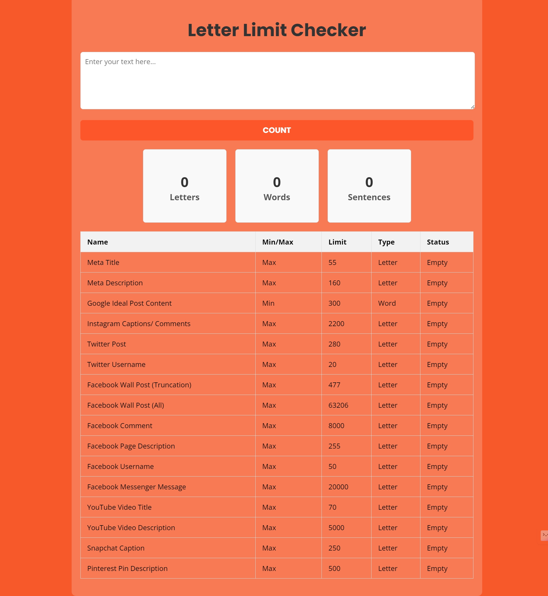

# Day #5

# Letter Limit Checker



## Table of Contents
- [Introduction](#introduction)
- [Features](#features)
- [Getting Started](#getting-started)
- [Usage](#usage)
- [Contributing](#contributing)
- [License](#license)
- [Live Demo](#live-demo)

## Introduction
The **Letter Limit Checker** is a web-based tool designed to analyze and count letters, words, and sentences in a given text. It also helps you ensure your content meets specific character or word limits for various platforms and use cases, such as social media posts and meta descriptions.

## Features
- Count letters, words, and sentences in the provided text
- Display counts dynamically as text is entered
- Compare text against predefined character and word limits for different content types
- Status indicators update based on the length of text entered
- Responsive design for both desktop and mobile devices

## Getting Started
### Prerequisites
To run the Letter Limit Checker, you need a modern web browser.

### Installation
1. Clone the repository:
   ```bash
   git clone https://github.com/Moiz-CodeByte/100-days-of-javascript.git
   ```
2. Navigate to the project directory:
   ```bash
   cd Day%20%2305%20-%20Letter%20Limit%20Checker
   ```
3. Open `index.html` in your web browser.

## Usage
1. Enter your text into the textarea provided.
2. Click the **Count** button to calculate the number of letters, words, and sentences.
3. View the results in the counter cards and the status table, which updates based on predefined limits for various content types.

## Contributing
Contributions are welcome! If you have any ideas, suggestions, or improvements, feel free to create a pull request or open an issue.

### Steps to Contribute
1. Fork the repository.
2. Create a new branch:
   ```bash
   git checkout -b feature/your-feature-name
   ```
3. Make your changes and commit them:
   ```bash
   git commit -m "Add your feature"
   ```
4. Push to the branch:
   ```bash
   git push origin feature/your-feature-name
   ```
5. Open a pull request.

### After Opening a Pull Request
1. **Review**: Address any feedback or change requests made by the reviewers.
2. **Approval**: Wait for the pull request to be approved by the maintainers.
3. **Merge**: Once approved, the pull request will be merged by a maintainer.
4. **Close**: The pull request will be closed upon merging. If not merged, it might be closed manually with an explanation.
5. **Cleanup**: Delete your feature branch after the pull request is merged and update your local repository.

## License
This project is open-source and available under the [MIT License](LICENSE).

## Live Demo
You can see the Letter Limit Checker live at [Link](https://moiz-codebyte.github.io/100-days-of-javascript/Day%20%2305%20-%20Letter%20Limit%20Checker/)

For any questions or support, please contact at [hello@abdulmoiz.net](mailto:hello@abdulmoiz.net).

