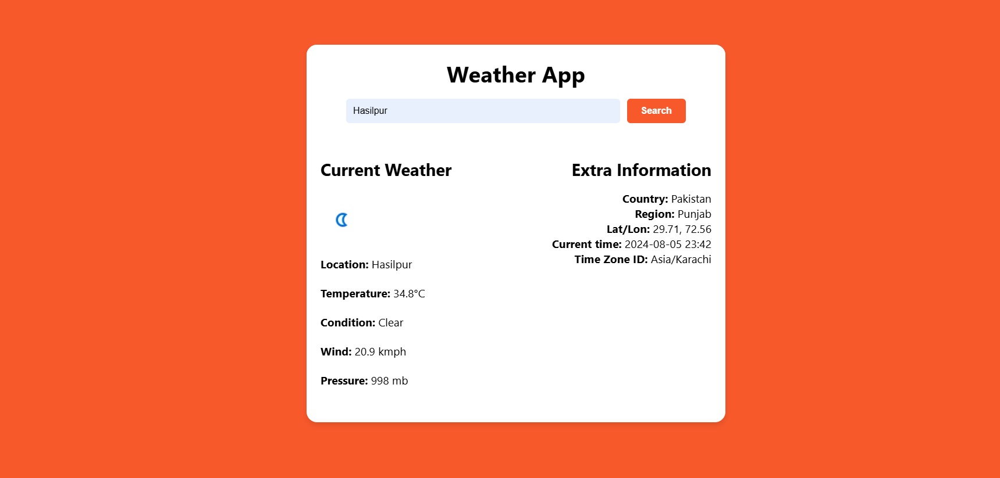

# Day #07

# Weather App



## Table of Contents
- [Introduction](#introduction)
- [Features](#features)
- [Getting Started](#getting-started)
- [Usage](#usage)
- [Contributing](#contributing)
- [License](#license)
- [Live Demo](#live-demo)

## Introduction
The **Weather App** is a simple web-based tool that allows users to get the current weather information for any city. It fetches data from the WeatherAPI and displays it in a user-friendly format.

## Features
- Input field for city name
- Display of current weather conditions, including temperature, condition, wind speed, and pressure
- Additional information such as country, region, latitude/longitude, local time, and time zone
- Responsive design for both desktop and mobile devices
- Error message display for invalid city names

## Getting Started
### Prerequisites
To run the Weather App, you need a modern web browser.

### Installation
1. Clone the repository:
   ```bash
   git clone https://github.com/Moiz-CodeByte/100-days-of-javascript.git
   ```
2. Navigate to the project directory:
   ```bash
   cd 100-days-of-javascript/Day%20%2306%20-%20Weather%20App
   ```
3. Open `index.html` in your web browser.

### Generating API Key
1. Go to [WeatherAPI](https://www.weatherapi.com/my/) and sign in or create an account.
2. Copy the API key provided in your account dashboard.
3. Open `script.js` and replace the placeholder API key with your own API key:
   ```javascript
   const apiKey = 'your_api_key_here';
   ```

## Usage
1. Enter the desired city name in the input field.
2. Click the **Search** button to fetch the weather data.
3. The weather information will be displayed, including the current temperature, condition, wind speed, pressure, and additional information.
4. If the city is not found, an error message will be displayed.

## Contributing
Contributions are welcome! If you have any ideas, suggestions, or improvements, feel free to create a pull request or open an issue.

### Steps to Contribute
1. Fork the repository.
2. Create a new branch:
   ```bash
   git checkout -b feature/your-feature-name
   ```
3. Make your changes and commit them:
   ```bash
   git commit -m "Add your feature"
   ```
4. Push to the branch:
   ```bash
   git push origin feature/your-feature-name
   ```
5. Open a pull request.

### After Opening a Pull Request
1. **Review**: Address any feedback or change requests made by the reviewers.
2. **Approval**: Wait for the pull request to be approved by the maintainers.
3. **Merge**: Once approved, the pull request will be merged by a maintainer.
4. **Close**: The pull request will be closed upon merging. If not merged, it might be closed manually with an explanation.
5. **Cleanup**: Delete your feature branch after the pull request is merged and update your local repository.

## License
This project is open-source and available under the [MIT License](LICENSE).

## Live Demo
You can see the Weather App live at [Link](https://moiz-codebyte.github.io/100-days-of-javascript/Day%20%2306%20-%20Weather%20App/)

For any questions or support, please contact at [hello@abdulmoiz.net](mailto:hello@abdulmoiz.net).

