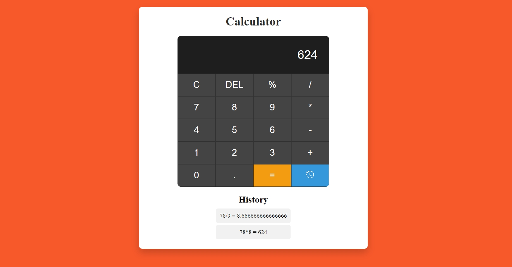

# Day #08

# Calculator



## Table of Contents
- [Introduction](#introduction)
- [Features](#features)
- [Getting Started](#getting-started)
- [Usage](#usage)
- [Contributing](#contributing)
- [License](#license)
- [Live Demo](#live-demo)

## Introduction
The **Calculator** is a web-based tool that performs basic arithmetic operations. It includes a display for the current calculation, buttons for digits and operations, and a history feature to keep track of past calculations.

## Features
- Basic arithmetic operations: addition, subtraction, multiplication, and division
- Percentage calculation
- Clear display and delete last digit functions
- Calculation history display with toggle visibility
- Responsive design for both desktop and mobile devices

## Getting Started
### Prerequisites
To run the Calculator, you need a modern web browser.

### Installation
1. Clone the repository:
   ```bash
   git clone https://github.com/Moiz-CodeByte/100-days-of-javascript.git
   ```
2. Navigate to the project directory:
   ```bash
   cd Day%20%2308%20-%20Calculator
   ```
3. Open `index.html` in your web browser.

## Usage
1. Use the buttons to input digits and operations into the display.
2. Click the **C** button to clear the display.
3. Click the **DEL** button to delete the last digit.
4. Click the **%** button to calculate the percentage.
5. Click the **=** button to calculate the result.
6. Click the **history** button to toggle the visibility of the calculation history.

## Contributing
Contributions are welcome! If you have any ideas, suggestions, or improvements, feel free to create a pull request or open an issue.

### Steps to Contribute
1. Fork the repository.
2. Create a new branch:
   ```bash
   git checkout -b feature/your-feature-name
   ```
3. Make your changes and commit them:
   ```bash
   git commit -m "Add your feature"
   ```
4. Push to the branch:
   ```bash
   git push origin feature/your-feature-name
   ```
5. Open a pull request.

### After Opening a Pull Request
1. **Review**: Address any feedback or change requests made by the reviewers.
2. **Approval**: Wait for the pull request to be approved by the maintainers.
3. **Merge**: Once approved, the pull request will be merged by a maintainer.
4. **Close**: The pull request will be closed upon merging. If not merged, it might be closed manually with an explanation.
5. **Cleanup**: Delete your feature branch after the pull request is merged and update your local repository.

## License
This project is open-source and available under the [MIT License](LICENSE).

## Live Demo
You can see the Calculator live at [Link](https://moiz-codebyte.github.io/100-days-of-javascript/Day%20%2308%20-%20Calculator/)

For any questions or support, please contact at [hello@abdulmoiz.net](mailto:hello@abdulmoiz.net).
