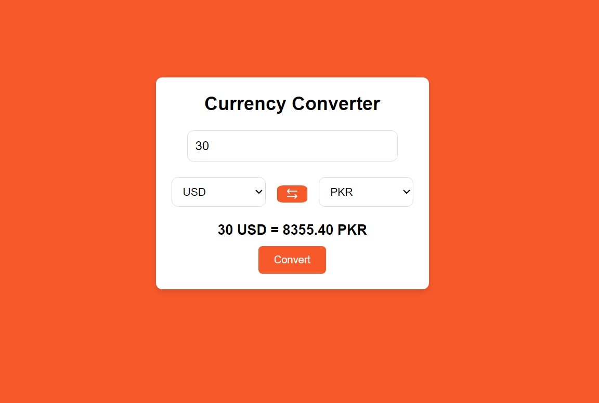

# Day #10

# Currency Converter



## Table of Contents
- [Introduction](#introduction)
- [Features](#features)
- [Getting Started](#getting-started)
- [Usage](#usage)
- [Contributing](#contributing)
- [License](#license)
- [Live Demo](#live-demo)

## Introduction
The **Currency Converter** is a web application that allows users to convert between different currencies using real-time exchange rates. The application fetches the latest exchange rates from an external API and performs the conversion based on user inputs.

## Features
- Fetches real-time exchange rates from an external API.
- Converts amounts between different currencies.
- Responsive design suitable for both desktop and mobile devices.
- Easy-to-use interface with dynamic calculations.

## Getting Started

### Installation
1. Clone the repository:
   ```bash
   git clone https://github.com/Moiz-CodeByte/100-days-of-javascript.git
   ```
2. Navigate to the project directory:
   ```bash
   cd Day%20%2310%20-%20Currency%20Converter
   ```
3. Open `index.html` in your web browser.

### Replace the API Key
Before running the application, replace the `apiKey` constant in `script.js` with your own API key from [ExchangeRatesAPI](https://manage.exchangeratesapi.io/dashboard):

```javascript
const apiKey = 'your_api_key_here';
```

## Usage
1. Open the application in your browser.
2. Enter the amount you want to convert in the "Amount" field.
3. Select the source currency from the first dropdown.
4. Select the target currency from the second dropdown.
5. The converted amount will be displayed below the input fields.


## Contributing
Contributions are welcome! If you have any ideas, suggestions, or improvements, feel free to create a pull request or open an issue.

### Steps to Contribute
1. Fork the repository.
2. Create a new branch:
   ```bash
   git checkout -b feature/your-feature-name
   ```
3. Make your changes and commit them:
   ```bash
   git commit -m "Add your feature"
   ```
4. Push to the branch:
   ```bash
   git push origin feature/your-feature-name
   ```
5. Open a pull request.

### After Opening a Pull Request
1. **Review**: Address any feedback or change requests made by the reviewers.
2. **Approval**: Wait for the pull request to be approved by the maintainers.
3. **Merge**: Once approved, the pull request will be merged by a maintainer.
4. **Close**: The pull request will be closed upon merging. If not merged, it might be closed manually with an explanation.
5. **Cleanup**: Delete your feature branch after the pull request is merged and update your local repository.

## License
This project is open-source and available under the [MIT License](../LICENSE).

## Live Demo
You can see the Currency Converter live at [Link](https://moiz-codebyte.github.io/100-days-of-javascript/Day%20%2310%20-%20Currency%20Converter/)

For any questions or support, please contact at [hello@abdulmoiz.net](mailto:hello@abdulmoiz.net).


