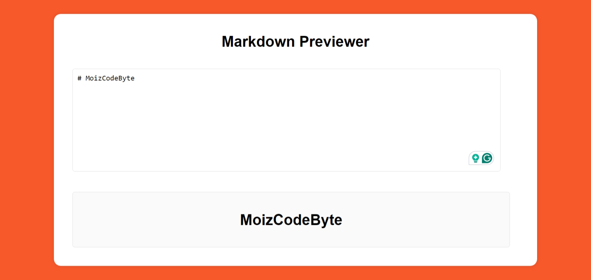

# Day #11

# Markdown Previewer



## Table of Contents
- [Introduction](#introduction)
- [Features](#features)
- [Getting Started](#getting-started)
- [Usage](#usage)
- [Contributing](#contributing)
- [License](#license)
- [Live Demo](#live-demo)

## Introduction
The **Markdown Previewer** is a web-based tool that converts Markdown text to HTML in real-time. It includes a text area for inputting Markdown and a preview area that displays the converted HTML.

## Features
- Real-time Markdown to HTML conversion
- Simple and clean user interface
- Responsive design for both desktop and mobile devices
- Supports basic Markdown syntax including headers, lists, links, and code blocks

## Getting Started
### Prerequisites
To run the Markdown Previewer, you need a modern web browser.

### Installation
1. Clone the repository:
   ```bash
   git clone https://github.com/Moiz-CodeByte/100-days-of-javascript.git
   ```
2. Navigate to the project directory:
   ```bash
   cd Day%20%2315%20-%20Markdown%20Previewer
   ```
3. Open `index.html` in your web browser.

## Usage
1. Type Markdown text into the textarea on the left side of the screen.
2. The converted HTML will appear in the preview area on the right side as you type.

## Contributing
Contributions are welcome! If you have any ideas, suggestions, or improvements, feel free to create a pull request or open an issue.

### Steps to Contribute
1. Fork the repository.
2. Create a new branch:
   ```bash
   git checkout -b feature/your-feature-name
   ```
3. Make your changes and commit them:
   ```bash
   git commit -m "Add your feature"
   ```
4. Push to the branch:
   ```bash
   git push origin feature/your-feature-name
   ```
5. Open a pull request.

### After Opening a Pull Request
1. **Review**: Address any feedback or change requests made by the reviewers.
2. **Approval**: Wait for the pull request to be approved by the maintainers.
3. **Merge**: Once approved, the pull request will be merged by a maintainer.
4. **Close**: The pull request will be closed upon merging. If not merged, it might be closed manually with an explanation.
5. **Cleanup**: Delete your feature branch after the pull request is merged and update your local repository.

## License
This project is open-source and available under the [MIT License](LICENSE).

## Live Demo
You can see the Markdown Previewer live at [Link](https://moiz-codebyte.github.io/100-days-of-javascript/Day%20%2315%20-%20Markdown%20Previewer/)

For any questions or support, please contact at [hello@abdulmoiz.net](mailto:hello@abdulmoiz.net).
