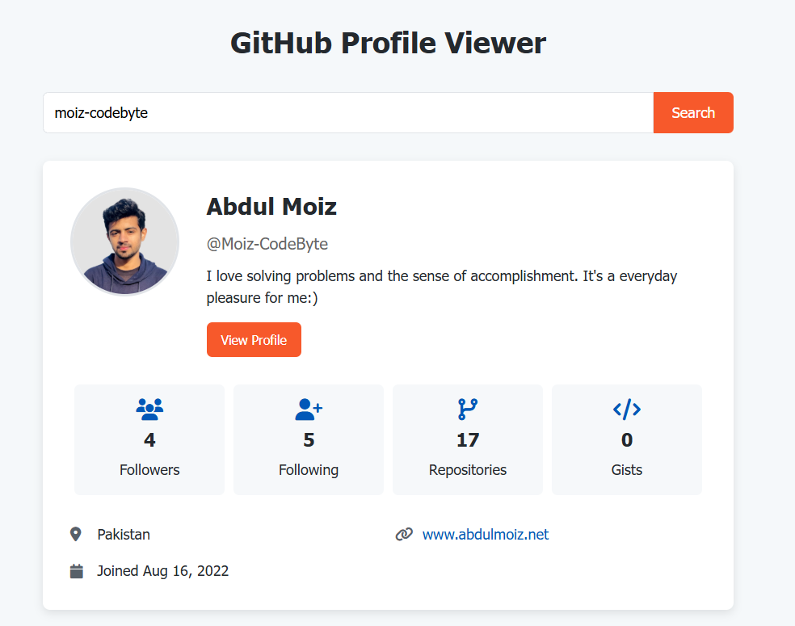

# GitHub Profile Preview App

A simple website that allows users to search for GitHub profiles and view detailed information about users.



## Table of Contents
- [Features](#features)

- [Technologies Used](#technologies-used)
- [Usage](#usage)
- [Api Information](#api-information)
- [Contributing](#contributing)
- [License](#license)
- [Live Demo](#live-demo)

## Features

- Search for GitHub users by username
- View user profile information including:
  - Profile picture
  - Name and username
  - Bio
  - Followers and following count
  - Number of repositories and gists
  - Location
  - Company
  - Blog/website
  - Twitter handle
  - Account creation date
- Responsive design that works on mobile and desktop
- Error handling for non-existent users

## Technologies Used

- HTML5
- CSS3 (with Flexbox and Grid layout)
- JavaScript (ES6+)
- GitHub REST API
- Font Awesome for icons

## Usage

1. Open the `index.html` file in your browser
2. Enter a GitHub username in the search box
3. Click the "Search" button or press Enter
4. View the user's profile information

## API Information

This app uses the GitHub REST API to fetch user data. No API key is required for basic usage, but there are rate limits for unauthenticated requests (60 requests per hour).

API Endpoint used: `https://api.github.com/users/{username}`


## Contributing
Contributions are welcome! If you have any ideas, suggestions, or improvements, feel free to create a pull request or open an issue.

### Steps to Contribute
1. Fork the repository.
2. Create a new branch:
   ```bash
   git checkout -b feature/your-feature-name
   ```
3. Make your changes and commit them:
   ```bash
   git commit -m "Add your feature"
   ```
4. Push to the branch:
   ```bash
   git push origin feature/your-feature-name
   ```
5. Open a pull request.

### After Opening a Pull Request
1. **Review**: Address any feedback or change requests made by the reviewers.
2. **Approval**: Wait for the pull request to be approved by the maintainers.
3. **Merge**: Once approved, the pull request will be merged by a maintainer.
4. **Close**: The pull request will be closed upon merging. If not merged, it might be closed manually with an explanation.
5. **Cleanup**: Delete your feature branch after the pull request is merged and update your local repository.

## License
This project is open-source and available under the [MIT License](LICENSE).

## Live Demo
You can see live at [Link](https://moiz-codebyte.github.io/100-days-of-javascriptDay%20%2313%20-%20GitHub%20Profile%20Preview/)

For any questions or support, please contact at [hello@abdulmoiz.net](mailto:hello@abdulmoiz.net).