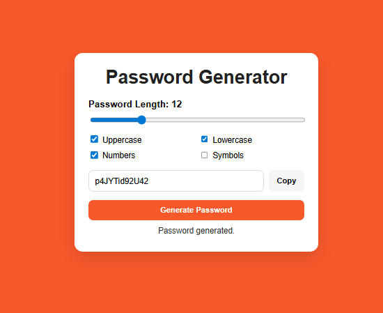

# Day #14

# Password Generator

## Table of Contents
- [Introduction](#introduction)
- [Features](#features)
- [Getting Started](#getting-started)
- [Usage](#usage)
- [Contributing](#contributing)
- [License](#license)
- [Live Demo](#live-demo)

## Introduction
The **Password Generator** is a web application that helps users create random passwords quickly. You can control length and character types to generate stronger passwords for daily use.




## Features
- Set password length from 6 to 32 characters
- Include uppercase letters
- Include lowercase letters
- Include numbers
- Include symbols
- Copy generated password to clipboard with one click
- Responsive layout for desktop and mobile

## Getting Started

### Installation
1. Clone the repository:
	```bash
	git clone https://github.com/Moiz-CodeByte/100-days-of-javascript.git
	```
2. Navigate to the project directory:
	```bash
	cd Day\ \#14\ -\ Password\ Generator
	```
3. Open `index.html` in your web browser.

## Usage
1. Move the length slider to choose password size.
2. Select one or more character types.
3. Click the **Generate Password** button.
4. Click **Copy** to copy the password to your clipboard.

## Contributing
Contributions are welcome! If you have ideas, suggestions, or improvements, feel free to open an issue or create a pull request.

### Steps to Contribute
1. Fork the repository.
2. Create a new branch:
	```bash
	git checkout -b feature/your-feature-name
	```
3. Make your changes and commit them:
	```bash
	git commit -m "Add your feature"
	```
4. Push your branch:
	```bash
	git push origin feature/your-feature-name
	```
5. Open a pull request.

## License
This project is open-source and available under the [MIT License](../LICENSE).

## Live Demo
You can see the Password Generator live at [Link](https://moiz-codebyte.github.io/100-days-of-javascript/Day%20%2314%20-%20Password%20Generator/)

For any questions or support, please contact at [hello@abdulmoiz.net](mailto:hello@abdulmoiz.net).
